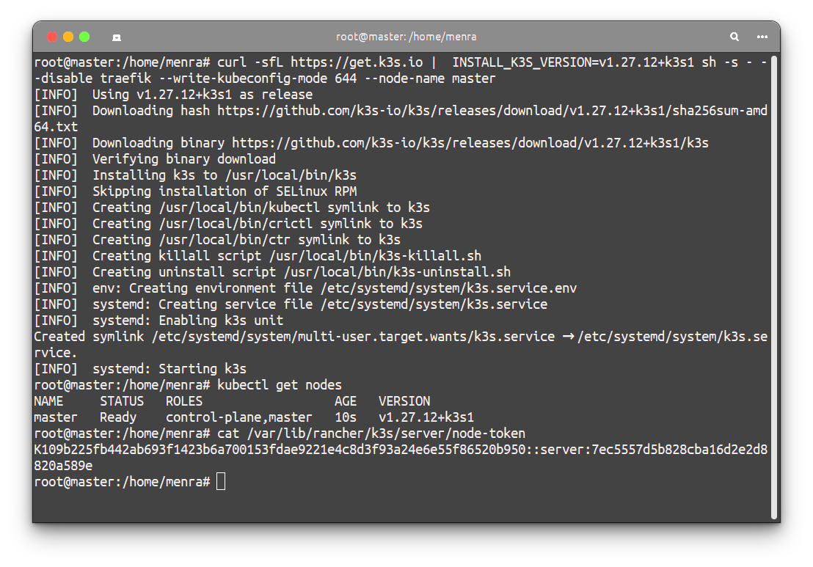
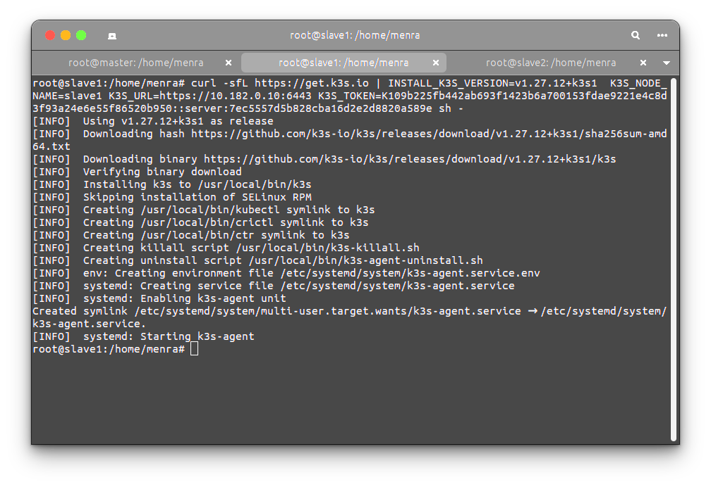
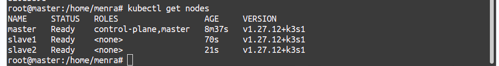
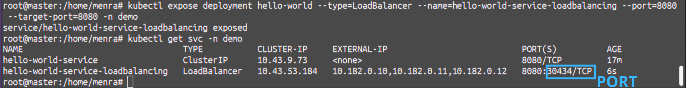
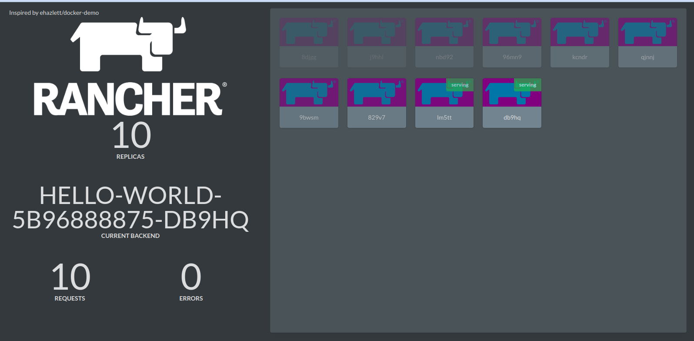

# Kubernetes Tutorial: Setting Up a K3s Cluster with a Hello-World Deployment

This tutorial will guide you through setting up a K3s cluster with one master node and two worker nodes, deploying a simple "Hello-World" application, and utilizing various `kubectl` commands to manage and inspect Kubernetes resources.

## Prerequisites

- Three Linux machines (or VMs) with access to each other.
- Basic understanding of Linux commands and Kubernetes concepts.

## Step 1: Installing K3s

### Install K3s on the Master Node

1. **SSH into the Master Node:**

    ```bash
    ssh user@master-node-ip
    ```

2. **Install K3s:**

    ```bash
    curl -sfL https://get.k3s.io |  INSTALL_K3S_VERSION=v1.27.12+k3s1 sh -s - --disable traefik --write-kubeconfig-mode 644 --node-name <NODE_NAME>
    ```

The command installs K3s version `v1.27.12+k3s1` on a node named `<NODE_NAME>`, disables the default Traefik ingress controller, and sets the permissions for the kubeconfig file to `644`.

3. **Verify Installation:**

    ```bash
    kubectl get nodes
    ```

    You should see the master node listed.

    

### Install K3s on the Worker Nodes

1. **SSH into each Worker Node:**

    ```bash
    ssh user@worker-node-ip
    ```

2. **Get the token from the master node**

    ```bash
    cat /var/lib/rancher/k3s/server/node-token
    ```

3. **Install K3s on Worker Nodes:**

    On each worker node, run:

    ```bash
    curl -sfL https://get.k3s.io | INSTALL_K3S_VERSION=v1.27.12+k3s1  K3S_NODE_NAME=YOUR_NODE_NAME K3S_URL=https://master-node-ip:6443 K3S_TOKEN=YOUR_NODE_TOKEN sh -
    ```

    You can find the `YOUR_NODE_TOKEN` value on the master node at `/var/lib/rancher/k3s/server/node-token`.



3. **Verify Worker Nodes Join the Cluster:**

    On the master node, run:

    ```bash
    kubectl get nodes
    ```

    You should see all nodes (master and workers) listed.

## Step 2: Verifying Node Status

To check the status of the nodes:

```bash
kubectl get nodes
```

You should see the master and worker nodes with the status `Ready`.



## Step 3: Creating a Pod

Create a simple pod to ensure everything is working correctly.

1. **Create a YAML file named `hello-world-pod.yaml`:**

    ```yaml
    apiVersion: v1
    kind: Pod
    metadata:
    name: hello-world
    spec:
    containers:
        - name: hello
        image: busybox  # Replace with your desired Docker image

    ```

2. **Apply the YAML file to create the pod:**

    ```bash
    kubectl apply -f hello-world-pod.yaml
    ```

3. **Verify the Pod is Running:**

    ```bash
    kubectl get pods
    ```

4. **Describe the Pod:**

    ```bash
    kubectl describe pod hello-world
    ```

## Step 4: Deleting the Pod

To delete the pod:

```bash
kubectl delete pod hello-world
```

## Step 5: Deploying the Application

### Creating a namespace

A namespace in Kubernetes is used to organize and manage resources within a cluster, providing isolation and a way to divide cluster resources among multiple users or teams.

The commands used in this process are:

1. **View Existing Namespaces**:
   ```bash
   kubectl get namespaces
   ```
   or 
   ```bash
   kubectl get ns
   ```

2. **Create a New Namespace**:
   ```bash
   kubectl create namespace demo
   ```

3. **Verify the Creation of the Namespace**:
   ```bash
   kubectl get namespaces
   ```

This process ensures you have successfully created the `demo` namespace and confirmed its presence in your Kubernetes cluster.

### Deployment YAML File

A deployment in Kubernetes is a controller that manages the creation, scaling, and updating of a set of replicated Pods, ensuring the desired state of an application is maintained.


Create a file named `hello-world-deployment.yaml` with the following content:

```yaml
apiVersion: apps/v1
kind: Deployment
metadata:
  name: hello-world
  namespace: demo
spec:
  replicas: 5
  selector:
    matchLabels:
      app: hello-world
  template:
    metadata:
      labels:
        app: hello-world
    spec:
      containers:
        - name: hello-world
          image: bashofmann/rancher-demo:1.0.0
          imagePullPolicy: Always
          ports:
            - containerPort: 8080
              name: web
              protocol: TCP
          env:
            - name: COW_COLOR
              value: purple
          readinessProbe:
            httpGet:
              path: /
              port: web
          livenessProbe:
            httpGet:
              path: /
              port: web
```

### Explanation of the YAML File

- **apiVersion**: Specifies the version of the Kubernetes API to use.
- **kind**: Specifies the type of resource being created (Deployment).
- **metadata**: Contains data that helps uniquely identify the object, including a `name` and `namespace`.
- **spec**: Defines the desired state of the Deployment.
  - **replicas**: Number of pod replicas to run.
  - **selector**: Defines how the Deployment finds which Pods to manage.
  - **template**: Defines the Pods that will be created.
    - **metadata**: Labels for the Pods.
    - **spec**: Specification of the containers within the Pods.
      - **containers**: List of containers in the Pod.
        - **name**: Name of the container.
        - **image**: Docker image to use for the container.
        - **imagePullPolicy**: Policy to use for image pulls.
        - **ports**: Ports to expose from the container.
        - **env**: Environment variables for the container.
        - **readinessProbe**: Defines a probe to check if the container is ready.
        - **livenessProbe**: Defines a probe to check if the container is alive.


---

For more information on using the image, please click [here](https://github.com/bashofmann/rancher-demo).


### Apply the Deployment

1. **Apply the YAML file to create the Deployment:**

    ```bash
    kubectl apply -f hello-world-deployment.yaml
    ```

2. **Verify the Deployment and Pods:**

    ```bash
    kubectl get deployments -n demo
    kubectl get pods -n demo
    ```

3. **Check the ReplicaSets:**

    ```bash
    kubectl get replicaset -n demo
    ```

4. **For more information on replicas:**

    ```bash
    kubectl get pods -n demo -o wide
    ```
    `-o wide`: Provides additional details about each pod, such as the node it's running on, the IP address, the container images, and more.


## Step 6: Exposing the Application

Create a service to expose the Deployment.

A service in Kubernetes provides a stable network endpoint to access a set of pods, ensuring consistent access despite pod restarts or IP changes.

#### Types of Services:

- **ClusterIP**: Exposes the service on an internal IP within the cluster, making it accessible only within the cluster.
- **NodePort**: Exposes the service on each node's IP at a static port, making it accessible from outside the cluster using `<NodeIP>:<NodePort>`.
- **LoadBalancer**: Exposes the service externally using a cloud provider's load balancer.
- **ExternalName**: Maps the service to the contents of the `externalName` field (e.g., `foo.bar.example.com`), creating a DNS alias.

1. **Create a ClusterIP Service:**

    ```bash
    kubectl expose deployment hello-world --type=ClusterIP --name=hello-world-service --port=8080 --target-port=8080 -n demo
    ```

    - **`expose deployment hello-world`**: Creates a service to expose the deployment named `hello-world`.
    - **`--type=ClusterIP`**: Specifies the type of service to create. `ClusterIP` means the service will be accessible only within the cluster.
    - **`--name=hello-world-service`**: Assigns the name `hello-world-service` to the newly created service.
    - **`--port=8080`**: Defines the port on which the service will be exposed.
    - **`--target-port=8080`**: Specifies the port on the pod that the service should forward traffic to.
    - **`-n demo`**: Limits the scope of the command to the `demo` namespace.


2. **Verify the Service:**

    ```bash
    kubectl get svc -n demo
    ```

## Step 7: Accessing the Application

To access the application from your local machine, use `kubectl port-forward`:

```bash
kubectl port-forward svc/hello-world-service 8080:8080 -n demo --address node_address
```

Open your browser and go to `http://node_address:8080` to see the application in action.

1. **Create a service of type LoadBalancer**

```bash
kubectl expose deployment hello-world --type=LoadBalancer --name=hello-world-service-loadbalancing --port=8080 --target-port=8080 -n demo
```

Open your browser and go to `http://any_node_address:PORT` to see the application in action. 
`PORT` here is generated by default, see the image below.



Application on the browser



## Step 8: Inspecting Resources

### Describing a Pod

To get detailed information about a specific pod:

```bash
kubectl describe pod <pod-name> -n demo
```

### Describing a Deployment

To get detailed information about the deployment:

```bash
kubectl describe deployment hello-world -n demo
```

### Viewing Pod Logs

To view the logs of a pod:

```bash
kubectl logs -f <pod-name> -n demo
```

## Step 9: Cleaning Up

To delete all the resources created:

```bash
kubectl delete namespace demo
```

## Conclusion

You've successfully set up a K3s cluster, deployed a simple application, and used various `kubectl` commands to manage and inspect Kubernetes resources. This foundation will help you explore Kubernetes further and leverage its capabilities.


# Bonus
## Scaling and Deploying a Horizontal Pod Autoscaler in Kubernetes

### Step 1: Scaling Up/Down Manually

You can manually scale the number of replicas in a deployment using the `kubectl scale` command.

#### Scale Up

To scale the `hello-world` deployment to 10 replicas:

```bash
kubectl scale deployment hello-world --replicas=10 -n demo
```

#### Scale Down

To scale the `hello-world` deployment back down to 3 replicas:

```bash
kubectl scale deployment hello-world --replicas=3 -n demo
```

### Step 2: Deploying a Horizontal Pod Autoscaler (HPA)

The Horizontal Pod Autoscaler automatically adjusts the number of pod replicas in a deployment based on observed CPU utilization (or other select metrics).

#### Prerequisites

Ensure that the Metrics Server is deployed in your cluster. The Metrics Server collects resource metrics from the Kubernetes nodes and pods and is required for HPA to function.

To install the Metrics Server:

```bash
kubectl apply -f https://github.com/kubernetes-sigs/metrics-server/releases/latest/download/components.yaml
```

#### Deploy HPA for the `hello-world` Deployment

1. **Create the HPA**

   ```bash
   kubectl autoscale deployment hello-world --cpu-percent=50 --min=1 --max=10 -n demo
   ```

   This command sets up an HPA for the `hello-world` deployment that:
   - Targets 50% CPU utilization.
   - Scales the number of pod replicas between 1 and 10 based on the observed CPU utilization.

2. **Verify the HPA**

   To check the status of the HPA:

   ```bash
   kubectl get hpa -n demo
   ```

   The output should show something like this:

   ```plaintext
   NAME          REFERENCE                TARGETS   MINPODS   MAXPODS   REPLICAS   AGE
   hello-world   Deployment/hello-world   10%/50%   1         10        3          5m
   ```

### Step 3: Testing the HPA

To test the HPA, you can simulate a load on the `hello-world` pods to observe the scaling behavior. Here's how you can do it:

1. **Run a Load Generator Pod**

   Create a pod that continuously sends requests to the `hello-world` service. Create a file named `load-generator.yaml` with the following content:

   ```yaml
   apiVersion: v1
   kind: Pod
   metadata:
     name: load-generator
     namespace: demo
   spec:
     containers:
     - name: busybox
       image: busybox
       args:
       - /bin/sh
       - -c
       - |
         while true; do wget -q -O- http://hello-world-service:8080; done
   ```

   Apply this YAML file:

   ```bash
   kubectl apply -f load-generator.yaml
   ```

2. **Monitor the HPA**

   Keep an eye on the HPA status to see how it adjusts the number of replicas:

   ```bash
   kubectl get hpa -n demo
   ```

   You should see the `TARGETS` column indicating higher CPU utilization, and the `REPLICAS` column increasing as the HPA scales up the deployment.

3. **Stop the Load Generator**

   Once you've observed the scaling behavior, delete the load generator pod:

   ```bash
   kubectl delete pod load-generator -n demo
   ```

### Summary

- **Manual Scaling**: Use `kubectl scale` to manually adjust the number of replicas.
- **Horizontal Pod Autoscaler (HPA)**: Automatically adjusts the number of replicas based on CPU utilization (or other metrics).
- **Metrics Server**: Required for HPA to function, it collects resource metrics.
- **Testing HPA**: Use a load generator to simulate traffic and observe the HPA scaling behavior.

This guide helps you understand and implement both manual and automatic scaling in Kubernetes, ensuring your applications can handle varying loads efficiently.


**Congratulations !!!**

>Why did the Kubernetes developer go >broke?

>Because he lost all his containers! 🤣
